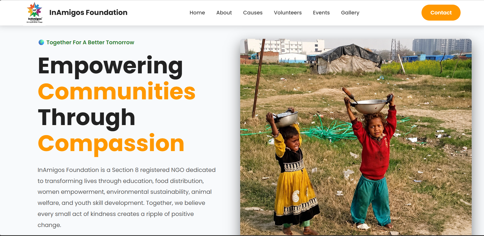
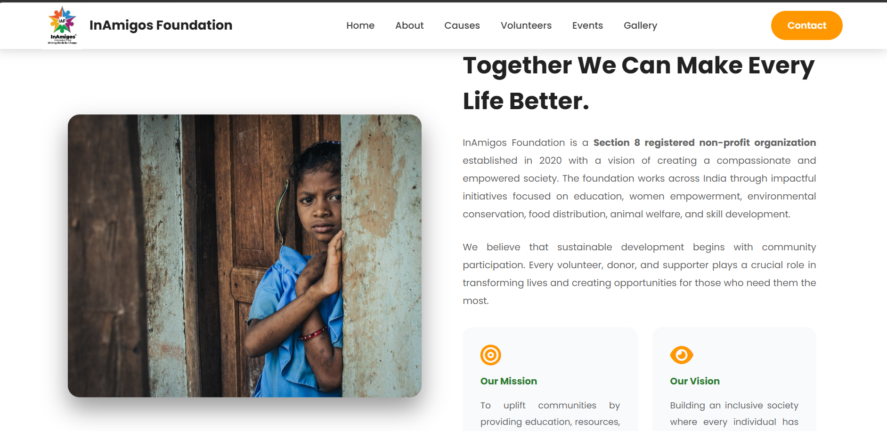
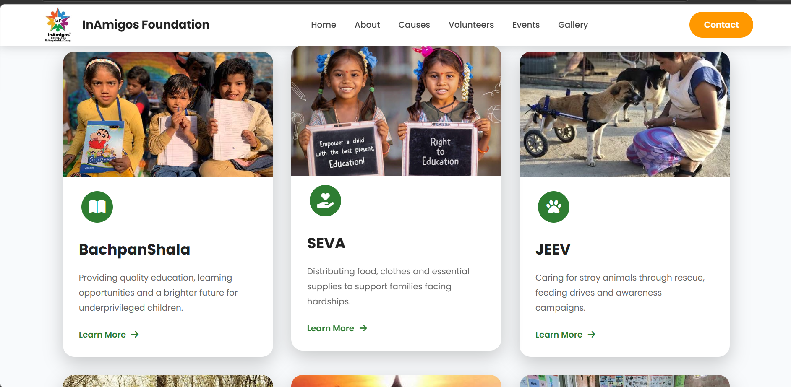
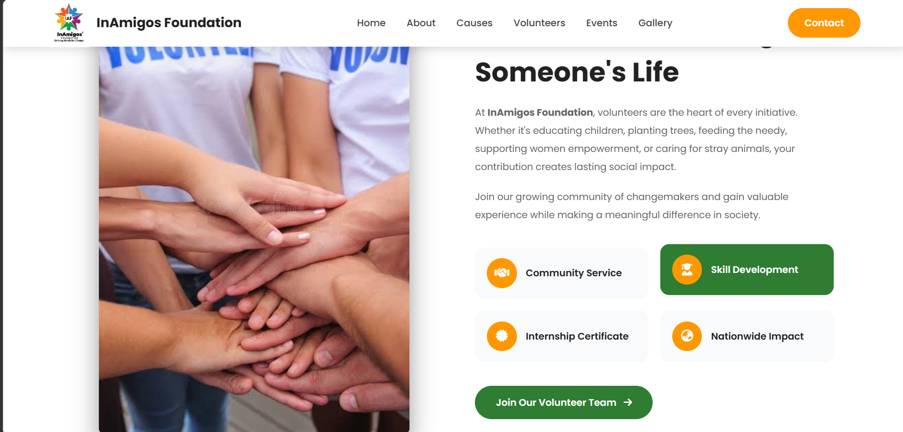
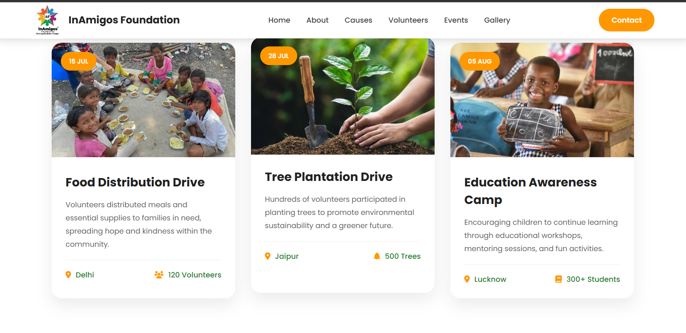
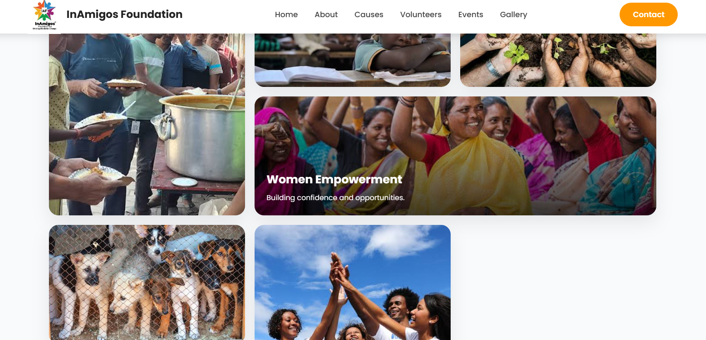
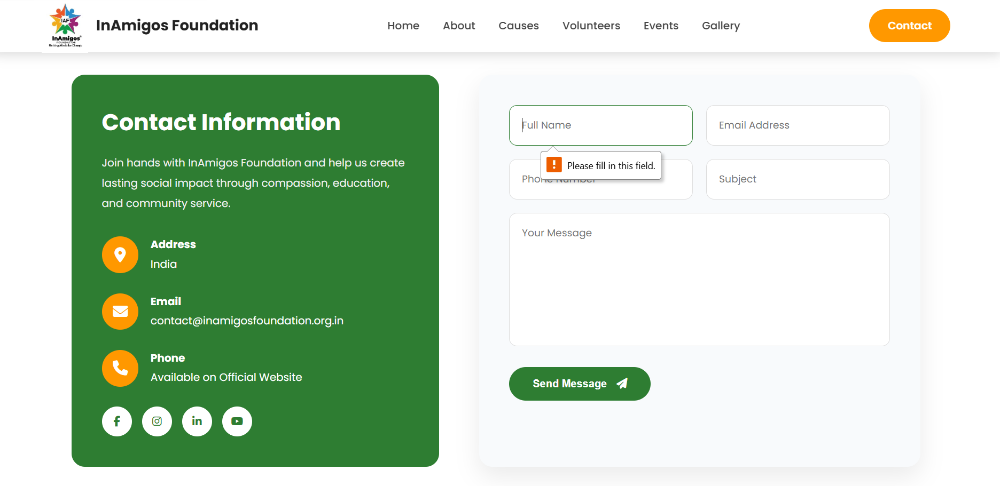

# NGO Awareness Webpage

A responsive and visually appealing multi-page NGO awareness website developed using **HTML, CSS, and JavaScript**. This project aims to spread awareness about an NGO's mission, initiatives, and community impact through an engaging and user-friendly interface.

## 🌟 Features

* Responsive design for desktop, tablet, and mobile devices
* Multi-page website with smooth navigation
* Clean and modern user interface
* Interactive elements using JavaScript
* Well-structured and reusable code
* Optimized layout for better user experience

## 🛠️ Tech Stack

* HTML5
* CSS3
* JavaScript

## 📂 Pages Included

* Home
* About
* Causes/Programs
* Gallery
* Contact

## 🎯 Purpose

This project was created as a frontend development task to demonstrate responsive web design, effective UI implementation, and modern web development practices while showcasing an NGO's vision, activities, and social initiatives.

## Github Repository

https://github.com/gauri9368gupta-maker/INAMIGOS-FOUNDATION

## Live Link 

https://gauri9368gupta-maker.github.io/INAMIGOS-FOUNDATION/TASK-1/

## 📸 Screenshots

## 👩‍💻 Author

**Gauri Gupta**
